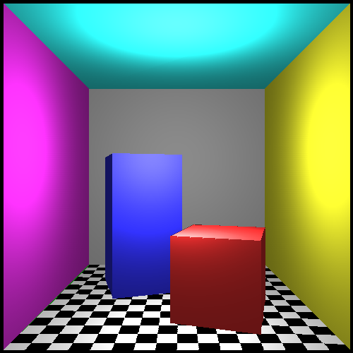

# COMS30115 Computer Graphics - Rasterizer Coursework

For this coursework we had to create a rasterizer in C++ using GLM and SDL.

The rasterizer that I created performs clipping and texture mapping.

## Screenshot



## Setup


Install SDL with the command:

```
sudo apt-get install libsdl1.2-dev
```

Clone the repository with the command:

```
$ git clone --recurse-submodules https://github.com/gchurch/rasterizer
````

## Compilation

To compile the code, enter the command:

```
$ make
```
## Execution

To execute the raytracer, enter the command:

```
$ make run
```
## Controls

You can move the camera's view by using the up, down, left, right, m and n keys

You can also move the light source's position by using the w, s, a and d keys
